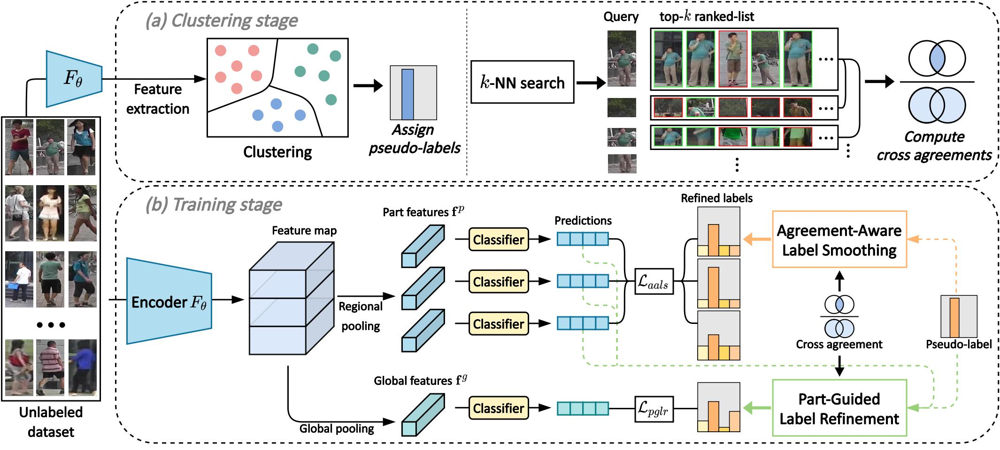

# Part-based Pseudo Label Refinement (PPLR)
Official PyTorch implementation of [Part-based Pseudo Label Refinement for Unsupervised Person Re-identification](https://arxiv.org/abs/2203.14675) (CVPR 2022).

## Updates
- [07/2022] Pretrained weights are released.
- [06/2022] Code is released.

## Overview

>We propose a Part-based Pseudo Label Refinement (PPLR) framework that reduces the label noise by employing the complementary relationship between global and part features.
Specifically, we design a cross agreement score as the similarity of k-nearest neighbors between feature spaces to exploit the reliable complementary relationship. 
Based on the cross agreement, we refine pseudo-labels of global features by ensembling the predictions of part features, which collectively alleviate the noise in global feature clustering. 
We further refine pseudo-labels of part features by applying label smoothing according to the suitability of given labels for each part.
Our PPLR learns discriminative representations with rich local contexts. Also, it operates in a self-ensemble manner without auxiliary teacher networks, which is computationally efficient.

## Getting Started
### Installation
```shell
git clone https://github.com/yoonkicho/PPLR
cd PPLR
python setup.py develop
```
### Preparing Datasets
```shell
cd examples && mkdir data
```
Download the object re-ID datasets [Market-1501](https://drive.google.com/file/d/0B8-rUzbwVRk0c054eEozWG9COHM/view), [MSMT17](https://arxiv.org/abs/1711.08565), and [VeRi-776](https://github.com/JDAI-CV/VeRidataset) to `PPLR/examples/data`.
The directory should look like:
```
PPLR/examples/data
├── Market-1501-v15.09.15
├── MSMT17_V1
└── VeRi
```
## Training
We utilize 4 TITAN RTX GPUs for training.
We use 384x128 sized images for Market-1501 and MSMT17 and 256x256 sized images for VeRi-776.

### Training without camera labels
For Market-1501:
```
CUDA_VISIBLE_DEVICES=0,1,2,3 \
python examples/train_pplr.py \
-d market1501 --logs-dir $PATH_FOR_LOGS
```
For MSMT17:
```
CUDA_VISIBLE_DEVICES=0,1,2,3 \
python examples/train_pplr.py \
-d msmt17 --logs-dir $PATH_FOR_LOGS
```
For VeRi-776:
```
CUDA_VISIBLE_DEVICES=0,1,2,3 \
python examples/train_pplr.py \
-d veri -n 8 --height 256 --width 256 --eps 0.7 --logs-dir $PATH_FOR_LOGS
```

### Training with camera labels
For Market-1501:
```
CUDA_VISIBLE_DEVICES=0,1,2,3 \
python examples/train_pplr_cam.py \
-d market1501 --eps 0.4 --logs-dir $PATH_FOR_LOGS
```
For MSMT17:
```
CUDA_VISIBLE_DEVICES=0,1,2,3 \
python examples/train_pplr_cam.py \
-d msmt17 --eps 0.6 --lam-cam 1.0 --logs-dir $PATH_FOR_LOGS
```
For VeRi-776:
```
CUDA_VISIBLE_DEVICES=0,1,2,3 \
python examples/train_pplr_cam.py \
-d veri -n 8 --height 256 --width 256 --eps 0.7 --logs-dir $PATH_FOR_LOGS
```

## Testing 
We use a single TITAN RTX GPU for testing.

You can download pre-trained weights from this [link](https://drive.google.com/drive/folders/1m5wDOJG7qk62PjkoOpTspNmk0nhLc4Vi?usp=sharing).

For Market-1501:
```
CUDA_VISIBLE_DEVICES=0\
python examples/test.py \
-d market1501 --resume $PATH_FOR_MODEL
```
For MSMT17:
```
CUDA_VISIBLE_DEVICES=0\
python examples/test.py \
-d msmt17 --resume $PATH_FOR_MODEL
```
For VeRi-776:
```
CUDA_VISIBLE_DEVICES=0\
python examples/test.py \
-d veri --height 256 --width 256 --resume $PATH_FOR_MODEL
```

## Acknowledgement
Some parts of the code is borrowed from [SpCL](https://github.com/yxgeee/SpCL).

## Citation
If you find this code useful for your research, please consider citing our paper:

````BibTex
@inproceedings{cho2022part,
  title={Part-based Pseudo Label Refinement for Unsupervised Person Re-identification},
  author={Cho, Yoonki and Kim, Woo Jae and Hong, Seunghoon and Yoon, Sung-Eui},
  booktitle={Proceedings of the IEEE/CVF Conference on Computer Vision and Pattern Recognition},
  pages={7308--7318},
  year={2022}
}
````
